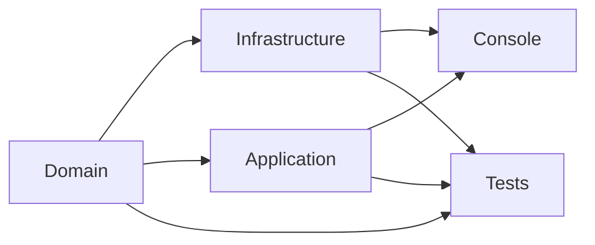

# DataQueryExplorer

A generic, extensible .NET 8 console utility for executing **nested queries** against Azure Cosmos DB and exporting results to Excel (`.xlsx`).

Designed for QA engineers, data analysts, and developers who need to explore multi-level relational data without writing custom scripts. No prior coding knowledge required to operate the tool from the console.

---

## Features

- **Six query strategies** — from a single-container simple query to a three-level inner join
- **Dynamic database & container selection** — auto-discovers all databases and containers from your live Cosmos endpoint; pick with arrow keys or type the name
- **Parameterised queries** — provide an Excel file with column values and the tool runs one query per row (batch processing)
- **Duplicate detection** — group child records by a property and flag those that exceed a count threshold
- **Progress bar** — real-time progress in the console
- **Timestamped log files** — every run produces a log in `./Logs - AppName/`
- **Excel output** — one worksheet per query level, with bold headers and an `IsChildFound` flag column
- **Clean Architecture** — Domain, Infrastructure, Application, Console layers; easy to extend
- **Extensible** — swap the database driver or storage format by implementing `IDatabaseClient`/`IStorageWriterFactory`

---

## Architecture

```
DataQueryExplorer.sln
├── src/
│   ├── DataQueryExplorer.Domain          # Interfaces, models, enums — no external deps
│   ├── DataQueryExplorer.Infrastructure  # Cosmos DB + Excel (ClosedXML) implementations
│   ├── DataQueryExplorer.Application     # Query strategies, SQL parser, DuplicateDetector
│   └── DataQueryExplorer.Console         # Entry point, DI wiring, console UI
└── tests/
    └── DataQueryExplorer.Tests           # xUnit unit tests
```



---

## Prerequisites

- [.NET 8 SDK](https://dotnet.microsoft.com/download/dotnet/8.0)
- An **Azure Cosmos DB** account (or the [local Cosmos Emulator](https://learn.microsoft.com/azure/cosmos-db/emulator))

---

## Quick Start

```bash
# Clone
git clone https://github.com/<your-username>/DataQueryExplorer.git
cd DataQueryExplorer

# Build
dotnet build

# Run
dotnet run --project src/DataQueryExplorer.Console
```

On first launch the tool prompts you for:
1. Cosmos DB endpoint URL
2. Read/write key
3. Output folder path
4. Query type (arrow-key selection)
5. Container(s) and SQL query/queries
6. *(If parameterised)* Input Excel file path

---

## Query Strategy Reference

| # | Strategy | Description |
|---|----------|-------------|
| 1 | **Single Container Query** | Query one container; optionally drive with an Excel input file of `@param` values |
| 2 | **Two-Level Join — All Results** | Parent + child container; writes both to separate sheets with `IsChildFound` flag |
| 3 | **Two-Level Join — Orphans Only** | Writes only parent records where **no** child was found |
| 4 | **Two-Level Join — Find Duplicates** | Groups child records by a property; writes only those exceeding your count threshold |
| 5 | **Three-Level Join — All Results** | Three-level traversal; writes all levels to separate sheets |
| 6 | **Three-Level Join — Inner Match** | Writes records only when **all three** levels are matched (inner join) |

---

## Query Examples

```sql
-- Parent query (no params needed)
SELECT c.id, c.order_code, c.status FROM c WHERE c.type = 'order'

-- Child query (uses @id from parent result)
SELECT c.id, c.product_name, c.quantity FROM c WHERE c.order_id = @id
```

---

## Extending

### Add a new database driver
1. Implement `IDatabaseClient` and `IDatabaseRepository<T>` in `DataQueryExplorer.Infrastructure`
2. Register the new implementation in `Program.cs`

### Add a new output format (CSV, JSON, SQL…)
1. Implement `IStorageWriterFactory` + `IStorageWriter` in `DataQueryExplorer.Infrastructure`
2. Register and inject where needed

---

## Running Tests

```bash
dotnet test
```

Tests cover `SqlQueryParser`, `DuplicateDetector`, and `ExcelStorageWriterFactory`.

---

## All Dependencies (MIT-licensed)

| Package | Version | License |
|---------|---------|---------|
| Microsoft.Azure.Cosmos | 3.35.4 | MIT |
| ClosedXML | 0.102.3 | MIT |
| Newtonsoft.Json | 13.0.3 | MIT |
| ShellProgressBar | 5.2.0 | MIT |
| Microsoft.Extensions.DependencyInjection | 8.0.0 | MIT |
| Microsoft.Extensions.Logging | 8.0.0 | MIT |
| xunit | 2.9.x | Apache 2.0 |
| NSubstitute | 5.1.0 | BSD-2-Clause |

---

## Contributing

See [CONTRIBUTING.md](CONTRIBUTING.md).

---

## License

[MIT](LICENSE)
